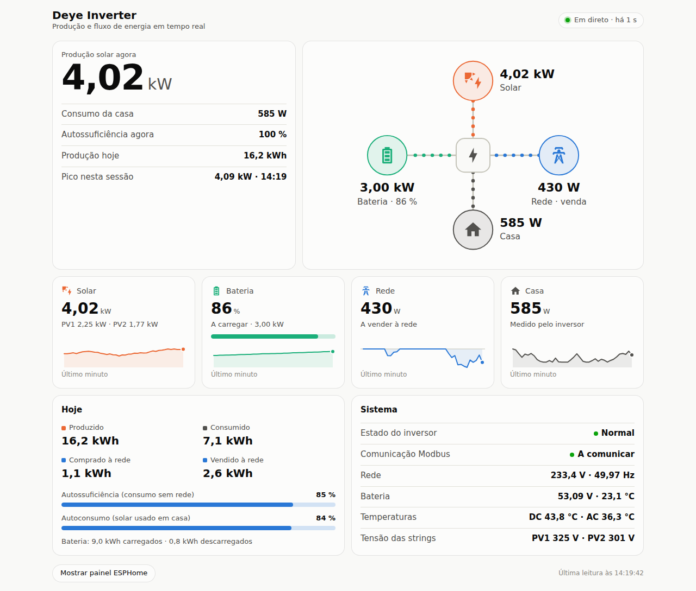
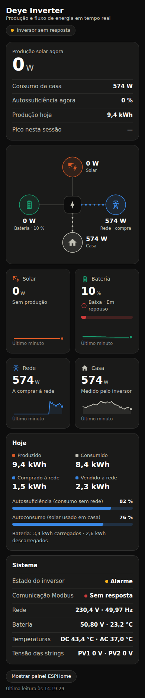

# Deye Web Server — dashboard ESPHome

Dashboard em tempo real para o inversor **Deye SUN-6K-SG05LP1** (híbrido monofásico, família SG0\*LP1), servido pelo `web_server` v3 do ESPHome, sem Home Assistant.





Mostra:

- **Produção solar agora**, consumo da casa, autossuficiência e pico da sessão
- **Fluxo de energia animado**: solar → inversor → bateria / rede / casa, com a direção e a velocidade a seguir a potência
- **Mosaicos com tendência** (Solar, Bateria, Rede, Casa), com o valor e a hora de cada ponto ao passar o rato ou tocar
- **Hoje**: kWh produzidos, consumidos, comprados e vendidos, autossuficiência e autoconsumo do dia
- **Sistema**: estado do inversor, comunicação Modbus, tensão e frequência da rede, bateria, temperaturas, tensão das strings
- Modo claro/escuro automático, adaptado a telemóvel e computador; o painel original do ESPHome continua disponível no botão "Mostrar painel ESPHome"

## Porque é CSS **e** JS

O `web_server` v3 desenha o UI dentro de um Web Component com Shadow DOM. Um `css_url` sozinho só consegue mudar o fundo e algumas cores, e não lê os valores dos sensores. Por isso:

| Ficheiro | Opção no YAML | Função |
|---|---|---|
| `deye-dashboard.css` | `css_url` | Tema e layout do dashboard |
| `deye-dashboard.js` | `js_url` | Cria o dashboard, carrega o UI original do ESPHome e reutiliza a mesma ligação SSE (`/events`). O ESP serve **uma** ligação por separador, não duas |

## Instalação

1. Copia `esphome/deye-inverter.yaml` e `esphome/secrets.example.yaml` para a pasta do ESPHome.
2. Renomeia `secrets.example.yaml` para `secrets.yaml` e preenche-o. Para gerar a chave da API: `openssl rand -base64 32`.
3. Compila e grava. Abre `http://<ip-do-esp>/`.

O essencial está no bloco `web_server`:

```yaml
web_server:
  port: 80
  version: 3
  css_url: https://cdn.jsdelivr.net/gh/DanielSilva-Shelly/DeyeWebServer@v1.0.0/deye-dashboard.css
  js_url: https://cdn.jsdelivr.net/gh/DanielSilva-Shelly/DeyeWebServer@v1.0.0/deye-dashboard.js
```

> ⚠️ **Não uses o URL do repositório** (`https://github.com/DanielSilva-Shelly/DeyeWebServer`) nem o `raw.githubusercontent.com`. O primeiro devolve uma página HTML; o segundo devolve `text/plain` com `nosniff`, e o browser recusa aplicar o ficheiro. O jsDelivr serve os ficheiros deste repositório público com o tipo MIME correto.

### Versões e cache

- **Recomendado:** usar uma tag (`@v1.0.0`, definida em `dash_version` nas `substitutions`). Cada versão fica imutável e só muda quando alterares o YAML. Para publicar uma versão nova, cria a tag seguinte (`v1.1.0`) e atualiza `dash_version`.
- `@main` segue o branch, mas o jsDelivr guarda-o em cache durante algumas horas. Para forçar a atualização: `https://purge.jsdelivr.net/gh/DanielSilva-Shelly/DeyeWebServer@main/deye-dashboard.js` (e o mesmo para o `.css`).

### Dependência de internet

O browser que abre o dashboard precisa de internet: vai buscar os ficheiros ao jsDelivr e o UI original a `oi.esphome.io`. Isto já acontece com o `web_server` v3 por defeito. Se precisares de funcionar offline, embebe os ficheiros no firmware:

```yaml
web_server:
  version: 3
  css_include: deye-dashboard.css
  js_include: deye-dashboard.js
  js_url: "" # sem internet o painel ESPHome original não carrega; o dashboard funciona na mesma
```

`local: true` **não** serve: substitui a página inteira e ignora `css_url`, `js_url` e os `*_include`.

## Sensores

O dashboard identifica as entidades pelo **nome** no YAML. Só as quatro primeiras são obrigatórias; as outras ativam secções extra quando existem.

| Chave | Nome no YAML | Registo | Notas |
|---|---|---|---|
| `pv` | Produção PV1 | 186 | **obrigatório** |
| `soc` | Nível da Bateria | 184 | **obrigatório** |
| `bat` | Potência da Bateria | 190 | **obrigatório**; S_WORD, + descarga / − carga |
| `grid` | Potência da Rede | 169 | **obrigatório**; S_WORD, + compra / − venda |
| `pv2` | Produção PV2 | 187 | somado à produção solar |
| `load` | Consumo da Casa | 178 | sem ele o consumo é estimado (solar + bateria + rede) e aparece com "≈" |
| `ePv` | Produção Solar Hoje | 108 | ×0,1 kWh |
| `eLoad` | Consumo Hoje | 84 | ×0,1 kWh |
| `eBuy` / `eSell` | Energia Comprada / Vendida Hoje | 76 / 77 | ×0,1 kWh |
| `eChg` / `eDis` | Carga / Descarga da Bateria Hoje | 70 / 71 | ×0,1 kWh |
| `state` | Estado do Inversor | 59 | text_sensor: Standby, Autoteste, Normal, Alarme, Falha |
| `link` | Ligação ao Inversor | — | binary_sensor: o Modbus está a responder |
| `vGrid` / `fGrid` | Tensão / Frequência da Rede | 150 / 79 | ×0,1 V / ×0,01 Hz |
| `vBat` / `tBat` | Tensão / Temperatura da Bateria | 183 / 182 | ×0,01 V / (x−1000)×0,1 °C |
| `tDc` / `tAc` | Temperatura DC / AC do Inversor | 90 / 91 | (x−1000)×0,1 °C |
| `vPv1` / `vPv2` | Tensão PV1 / PV2 | 109 / 111 | ×0,1 V |

Mapa de registos: *Deye Modbus protocol V118*, híbrido monofásico SG0\*LP1 (o mesmo que o [ha-solarman](https://github.com/davidrapan/ha-solarman) usa em `deye_hybrid.yaml`). Todos os registos são `holding`.

> Em alguns firmwares a potência da rede e a da casa (169/178) vêm em unidades de 10 W. Se os valores parecerem 10× mais pequenos do que na app Solarman, acrescenta `filters: [multiply: 10]` a esses sensores.

### Nomes diferentes ou sinais invertidos

As opções estão no topo de `deye-dashboard.js` (`CFG`). Para as mudar sem fork, usa um wrapper embebido no firmware que define `window.DEYE_DASH` antes de carregar o script:

```js
// deye-config.js  →  web_server: { js_include: deye-config.js, js_url: "" }
window.DEYE_DASH = {
  sensors: { pv: "PV1 Power", soc: "Battery SOC" }, // só as que mudam
  gridPositiveIsImport: true,
  batteryPositiveIsDischarge: true,
};
const s = document.createElement("script");
s.src = "https://cdn.jsdelivr.net/gh/DanielSilva-Shelly/DeyeWebServer@v1.0.0/deye-dashboard.js";
document.body.appendChild(s);
```

## Hardware

```
Tomada 230 V → carregador USB 5 V/2 A → ESP32 DevKit
ESP32 GPIO17 (TX) → DI  ┐
ESP32 GPIO16 (RX) ← RO  ├ módulo RS485 M5Stack (SP485EEN), Grove 5 V / GND
                        ┘ A/B → RJ45 pinos 7/8 → porta Modbus do Deye
```

Checklist:

- **Porta certa no Deye:** usa a porta RS485/Modbus de monitorização. Não uses a *Meter-485* nem a *BMS*: nessas o inversor é o mestre do barramento.
- **Sem resposta?** Troca A/B. Não danifica nada e é a causa mais comum. Depois confirma o endereço Modbus (1 por defeito) e os 9600 baud.
- **Níveis lógicos:** o SP485EEN funciona a 5 V. Com o módulo ligado mas sem tráfego, mede a tensão entre o pino RX (GPIO16) e o GND. Se passar de 3,6 V, põe um divisor resistivo (por exemplo 10 kΩ / 20 kΩ) no RX. O ESP32 não tolera 5 V.
- **Cabo:** os pinos 7 e 8 são um par entrançado no RJ45, o que é bom para RS485. Para distâncias curtas não precisas de terminação de 120 Ω.
- Com o ESP32, o Modbus usa a UART2 e os logs por USB ficam disponíveis (no ESP8266 era preciso desligá-los, porque o Modbus ocupava a UART0).

## Pré-visualização local

```bash
npx http-server . -p 8080
# http://localhost:8080/dev/preview.html            dia, todos os sensores
# http://localhost:8080/dev/preview.html?s=noite&estado=Alarme&modbus=0
# http://localhost:8080/dev/preview.html?s=venda
# http://localhost:8080/dev/preview.html?min=1      só os 4 sensores obrigatórios
```

A página simula o stream `/events` do ESPHome, por isso não precisas do ESP.
