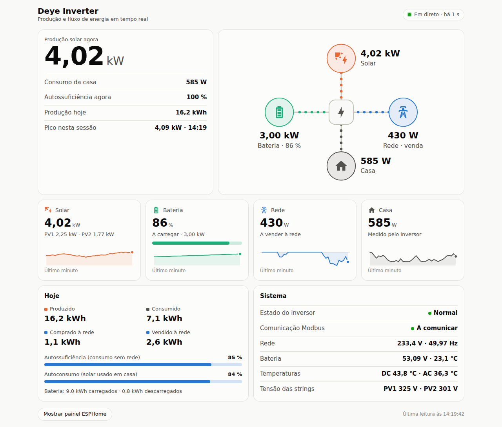
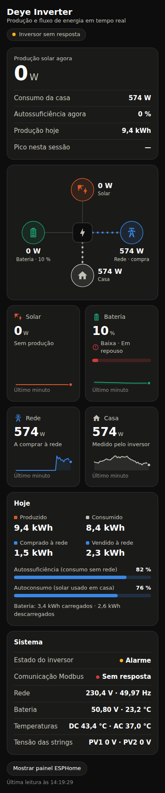

# Deye Web Server — dashboard ESPHome

Dashboard em tempo real para o inversor **Deye SUN-6K-SG05LP1** (híbrido monofásico, família SG0\*LP1), servido pelo `web_server` v3 do ESPHome, sem Home Assistant.





Mostra:

- **Produção solar agora**, consumo da casa, autossuficiência e pico da sessão
- **Fluxo de energia animado**: solar → inversor → bateria / rede / casa, com a direção e a velocidade a seguir a potência
- **Mosaicos com tendência** (Solar, Bateria, Rede, Casa), com o valor e a hora de cada ponto ao passar o rato ou tocar
- **Hoje**: kWh produzidos, consumidos, comprados e vendidos, autossuficiência e autoconsumo do dia
- **Sistema**: estado do inversor, comunicação Modbus, tensão e frequência da rede, bateria, temperaturas, tensão das strings
- Modo claro/escuro automático, adaptado a telemóvel e computador; o painel original do ESPHome continua disponível no botão "Mostrar painel ESPHome"

## Porque é CSS **e** JS

O `web_server` v3 desenha o UI dentro de um Web Component com Shadow DOM. Um `css_url` sozinho só consegue mudar o fundo e algumas cores, e não lê os valores dos sensores. Por isso:

| Ficheiro | Opção no YAML | Função |
|---|---|---|
| `deye-dashboard.css` | `css_url` | Tema e layout do dashboard |
| `deye-dashboard.js` | `js_url` | Cria o dashboard, carrega o UI original do ESPHome e reutiliza a mesma ligação SSE (`/events`). O ESP serve **uma** ligação por separador, não duas |

## Instalação

1. Copia o YAML da tua placa e `esphome/secrets.example.yaml` para a pasta do ESPHome:
   - ESP32 DevKit: `esphome/deye-inverter.yaml` (Modbus na UART2, GPIO16/17)
   - ESP8266 / ESP-12: `esphome/deye-inverter-esp8266.yaml` (Modbus na UART0, GPIO1/3; logs só pelo WiFi)
2. Renomeia `secrets.example.yaml` para `secrets.yaml` e preenche-o. Para gerar a chave da API: `openssl rand -base64 32`.
3. Compila e grava. Abre `http://<ip-do-esp>/`.

### Sem RS485: os dados vindos do Home Assistant

O coletor WiFi do inversor expõe Modbus TCP (porta 8899, protocolo Solarman V5). O ESPHome não tem cliente Modbus TCP, por isso o caminho é pelo Home Assistant: instala a integração [ha-solarman](https://github.com/davidrapan/ha-solarman) apontada ao IP do coletor, e usa `esphome/deye-inverter-esp8266-ha.yaml`, que importa os valores do HA pela API do ESPHome em vez de interrogar o inversor por Modbus.

O dashboard funciona sem uma alteração, porque identifica as entidades pelo **nome** e não pela origem. Só tens de preencher os `entity_id` do teu HA.

Troca-offs: o ESP passa a depender do HA e do coletor, e o coletor costuma aceitar um só cliente Modbus de cada vez — polling agressivo pode cortar-lhe a ligação à cloud Solarman. O caminho RS485 é mais direto e independente.

Sem Home Assistant à mão, usa `esphome/deye-inverter-esp8266-standalone.yaml`: tem três redes WiFi e todos os valores nas `substitutions`, por isso não precisa de `secrets.yaml`. Preenche o topo do ficheiro e grava com `pip install esphome && esphome run esphome/deye-inverter-esp8266-standalone.yaml`.

O essencial está no bloco `web_server`:

```yaml
web_server:
  port: 80
  version: 3
  css_url: https://cdn.jsdelivr.net/gh/DanielSilva-Shelly/DeyeWebServer@v1.0.1/deye-dashboard.css
  js_url: https://cdn.jsdelivr.net/gh/DanielSilva-Shelly/DeyeWebServer@v1.0.1/deye-dashboard.js
```

> ⚠️ **Não uses o URL do repositório** (`https://github.com/DanielSilva-Shelly/DeyeWebServer`) nem o `raw.githubusercontent.com`. O primeiro devolve uma página HTML; o segundo devolve `text/plain` com `nosniff`, e o browser recusa aplicar o ficheiro. O jsDelivr serve os ficheiros deste repositório público com o tipo MIME correto.

### Versões e cache

- **Recomendado:** usar uma tag (`@v1.0.1`, definida em `dash_version` nas `substitutions`). Cada versão fica imutável e só muda quando alterares o YAML. Para publicar uma versão nova, cria a tag seguinte (`v1.0.2`) e atualiza `dash_version`.
- `@main` segue o branch, mas o jsDelivr guarda-o em cache durante algumas horas. Para forçar a atualização: `https://purge.jsdelivr.net/gh/DanielSilva-Shelly/DeyeWebServer@main/deye-dashboard.js` (e o mesmo para o `.css`).

### Dependência de internet

O browser que abre o dashboard precisa de internet: vai buscar os ficheiros ao jsDelivr e o UI original a `oi.esphome.io`. Isto já acontece com o `web_server` v3 por defeito. Se precisares de funcionar offline, embebe os ficheiros no firmware:

```yaml
web_server:
  version: 3
  css_include: deye-dashboard.css
  js_include: deye-dashboard.js
  js_url: "" # sem internet o painel ESPHome original não carrega; o dashboard funciona na mesma
```

`local: true` **não** serve: substitui a página inteira e ignora `css_url`, `js_url` e os `*_include`.

## Sensores

O dashboard identifica as entidades pelo **nome** no YAML. Só as quatro primeiras são obrigatórias; as outras ativam secções extra quando existem.

| Chave | Nome no YAML | Registo | Notas |
|---|---|---|---|
| `pv` | Produção PV1 | 186 | **obrigatório** |
| `soc` | Nível da Bateria | 184 | **obrigatório** |
| `bat` | Potência da Bateria | 190 | **obrigatório**; S_WORD, + descarga / − carga |
| `grid` | Potência da Rede | 169 | **obrigatório**; S_WORD, + compra / − venda |
| `pv2` | Produção PV2 | 187 | somado à produção solar |
| `load` | Consumo da Casa | 178 | sem ele o consumo é estimado (solar + bateria + rede) e aparece com "≈" |
| `ePv` | Produção Solar Hoje | 108 | ×0,1 kWh |
| `eLoad` | Consumo Hoje | 84 | ×0,1 kWh |
| `eBuy` / `eSell` | Energia Comprada / Vendida Hoje | 76 / 77 | ×0,1 kWh |
| `eChg` / `eDis` | Carga / Descarga da Bateria Hoje | 70 / 71 | ×0,1 kWh |
| `state` | Estado do Inversor | 59 | text_sensor: Standby, Autoteste, Normal, Alarme, Falha |
| `link` | Ligação ao Inversor | — | binary_sensor: o Modbus está a responder |
| `vGrid` / `fGrid` | Tensão / Frequência da Rede | 150 / 79 | ×0,1 V / ×0,01 Hz |
| `vBat` / `tBat` | Tensão / Temperatura da Bateria | 183 / 182 | ×0,01 V / (x−1000)×0,1 °C |
| `tDc` / `tAc` | Temperatura DC / AC do Inversor | 90 / 91 | (x−1000)×0,1 °C |
| `vPv1` / `vPv2` | Tensão PV1 / PV2 | 109 / 111 | ×0,1 V |

Mapa de registos: *Deye Modbus protocol V118*, híbrido monofásico SG0\*LP1 (o mesmo que o [ha-solarman](https://github.com/davidrapan/ha-solarman) usa em `deye_hybrid.yaml`). Todos os registos são `holding`.

> Em alguns firmwares a potência da rede e a da casa (169/178) vêm em unidades de 10 W. Se os valores parecerem 10× mais pequenos do que na app Solarman, acrescenta `filters: [multiply: 10]` a esses sensores.

### Nomes diferentes ou sinais invertidos

As opções estão no topo de `deye-dashboard.js` (`CFG`). Para as mudar sem fork, usa um wrapper embebido no firmware que define `window.DEYE_DASH` antes de carregar o script:

```js
// deye-config.js  →  web_server: { js_include: deye-config.js, js_url: "" }
window.DEYE_DASH = {
  sensors: { pv: "PV1 Power", soc: "Battery SOC" }, // só as que mudam
  gridPositiveIsImport: true,
  batteryPositiveIsDischarge: true,
};
const s = document.createElement("script");
s.src = "https://cdn.jsdelivr.net/gh/DanielSilva-Shelly/DeyeWebServer@v1.0.1/deye-dashboard.js";
document.body.appendChild(s);
```

## Hardware

```
Tomada 230 V → carregador USB 5 V/2 A → ESP32 DevKit
ESP32 GPIO17 (TX) → DI  ┐
ESP32 GPIO16 (RX) ← RO  ├ módulo RS485 M5Stack (SP485EEN), Grove 5 V / GND
                        ┘ A/B → RJ45 pinos 7/8 → porta Modbus do Deye
```

Checklist:

- **Alimentação nas portas:** a porta **485/Meter** fornece alimentação em alguns pinos — é assim que alimenta dongles como os módulos LoRa. A porta **Modbus** não fornece nada. Nunca ligues o A ou o B a um pino com tensão: os 12 V estão no limite absoluto de um recetor RS485, que tolera até +12 V, e é o tipo de ligação que mata o recetor e deixa o emissor a funcionar.
- **Porta certa no Deye:** usa a porta **Modbus** (porta 8), onde os pinos 7 e 8 são o `sunspec-485_A` e o `sunspec-485_B`. Não uses a *RS485/Meter* nem a *BMS/CAN*: nessas o inversor é o mestre e nunca responde a um pedido teu.
- **Configuração no inversor:** a única necessária é o endereço, em `Settings → Advanced Function → Paral. Set3 → Modbus SN`, a 01. Não há nada mais para ativar, e o barramento é 9600 8N1.
- **Testa o caminho de receção antes de culpar o inversor.** Com o RJ45 desligado e o módulo alimentado, força um diferencial nos terminais: GND do ESP no A e 3V3 no B. O recetor põe o RO em nível baixo, e uma linha permanentemente em baixo é lida pela UART como um fluxo contínuo de bytes nulos — o log inunda de `<<< 00:00:00`. Invertendo os jumpers, tem de parar. Se não inundar em nenhuma das posições, o caminho de receção está cortado e nada mais vai funcionar.
- **Sem resposta?** Troca A/B. Não danifica nada e é a causa mais comum. Depois confirma o endereço Modbus (1 por defeito) e os 9600 baud.
- **Alimentação do módulo:** o M5Stack Unit RS485 (U034) é especificado para **12 V no terminal** e traz um conversor step-down. O pinmap oficial mostra 5 V no Grove, mas não garante que os 5 V do Grove sozinhos cheguem para o transcetor. Antes de procurar o problema no barramento, confirma que o módulo está alimentado: com o módulo ligado e em repouso, mede a tensão entre A e B. Tem de dar algumas centenas de mV, com A acima de B. Se der 0 V, alimenta o terminal com 12 V.
- **Níveis lógicos:** o SP485EEN funciona a 5 V. Com o módulo ligado mas sem tráfego, mede a tensão entre o pino RX (GPIO16 no ESP32, GPIO3 no ESP8266) e o GND. Se passar de 3,6 V, põe um divisor resistivo (por exemplo 10 kΩ / 20 kΩ) no RX. Nem o ESP32 nem o ESP8266 toleram 5 V.
- **TX/RX trocados:** é a causa mais comum de silêncio total no barramento. Os fios do Grove não têm uma cor normalizada para o DI e o RO, por isso troca-os e volta a testar antes de mexer em mais nada.
- **Controlo de direção:** o Unit RS485 só expõe quatro pinos no Grove, por isso comuta o DE sozinho a partir do sinal do DI. Esse circuito foi pensado para lógica de 5 V e pode não comutar de forma fiável com os 3,3 V de um ESP. Se o módulo nunca atacar o barramento, usa um módulo que exponha o pino DE e controla-o pelo ESPHome:

  ```yaml
  modbus:
    id: modbus_bus
    uart_id: uart_bus
    flow_control_pin: GPIO5 # DE/RE do módulo: fica HIGH enquanto o ESP transmite
  ```

  Um módulo com MAX3485 (versão de 3,3 V) dispensa também o divisor no RX.
- **ESP8266 em placa com USB (NodeMCU, D1 mini):** o chip USB-série também está ligado ao GPIO1/GPIO3 e pode interferir com o módulo RS485. Alimenta a placa pelo carregador e não por um PC, e desliga o módulo RS485 quando gravares por cabo.
- **Cabo:** os pinos 7 e 8 são um par entrançado no RJ45, o que é bom para RS485. Para distâncias curtas não precisas de terminação de 120 Ω.
- **T568A ou T568B:** as cores só dizem em que pino cada fio está se o cabo for T568B, onde o pino 1 é o branco-laranja e o pino 2 o laranja. Num cabo T568A esses dois fios caem nos pinos 3 e 6, que no Deye são **GND**: ficavas com o A e o B em curto à massa, e o barramento em silêncio. Olha para a ficha com o trinco virado para baixo: em T568B o primeiro fio à esquerda é branco-laranja; em T568A é branco-verde.
- **Teste rápido do barramento:** com o RJ45 ligado ao inversor e o módulo alimentado, mede a tensão contínua entre o A e o B do terminal. Umas centenas de mV, com o A acima do B, significa que o barramento tem polarização e que os fios chegam aos pinos certos. Exatamente 0,00 V aponta para módulo sem alimentação ou fios nos pinos de GND.
- Com o ESP32, o Modbus usa a UART2 e os logs por USB ficam disponíveis. No ESP8266 o Modbus ocupa a UART0, por isso os logs só estão disponíveis pelo WiFi.

## Diagnóstico: o ESP não se liga ao WiFi

Os YAMLs definem um AP de recurso (`Deye Inverter Fallback` / `Deye Inverter Fallback Hotspot`) com `captive_portal`. Cerca de 90 s depois de falhar a ligação, o ESP liga esse AP. É assim que mudas de rede sem gravar nada:

1. Com o telemóvel, liga-te ao AP de recurso (password em `fallback_password`). Se o AP não aparecer, o problema é de alimentação ou de arranque, não de WiFi.
2. Abre `http://192.168.4.1/`. O portal não pede as credenciais do dashboard.
3. A página lista as redes que o ESP vê. Isto é o melhor diagnóstico que tens:
   - **A rede não aparece:** é 5 GHz, está oculta, ou o sinal não chega. O ESP8266 e o ESP32 só funcionam em 2,4 GHz.
   - **Aparece:** escolhe-a, escreve a password e grava. O ESP liga-se em segundos.
4. Para descobrir o IP: lista de clientes do router (procura `deye-inverter`) ou `http://deye-inverter.local/`.

> ⚠️ As credenciais do portal ficam na flash e **substituem** a lista de redes do YAML, não se juntam a ela. Depois de usares o portal, o ESP passa a ligar-se só a essa rede, até gravares outra vez. Para teres várias casas, acrescenta as redes ao YAML.

Se o portal não resolver, as causas mais comuns são:

- **SSID ou password com erro:** confirma maiúsculas, hífenes e acentos. Compara com o que o portal mostra na lista.
- **WPA3 ou "WPA2/WPA3 mixed" com PMF obrigatório:** o ESP8266 não suporta WPA3. Põe o router em WPA2.
- **Rede oculta:** acrescenta `fast_connect: true` ao bloco `wifi`.
- **Filtro de MAC** ou lista de dispositivos autorizados no router.
- **Canal 12/13:** alguns módulos só ligam até ao canal 11. Fixa o router num canal entre 1 e 11.

## Diagnóstico: o dashboard aparece mas os valores ficam em "—"

O estado passa a "Sem leituras do inversor". O ESP está ligado e a enviar os sensores, mas os sensores chegam vazios (`NA`) porque o inversor não respondeu ao Modbus.

1. **Confirma que o módulo RS485 e o inversor estão ligados.** Só com o ESP, sem o módulo e o inversor, este estado é o esperado.
2. **Espera pelo primeiro ciclo de leitura:** 10 s nas potências e 60 s no resto.
3. **Vê os logs pelo WiFi:** no painel ESPHome original (botão "Mostrar painel ESPHome") ou com `esphome logs <yaml>`. O `logger` tem de estar em `INFO` ou `DEBUG`; com `NONE` não aparece nada.
   - `Stop waiting for response from 1` seguido de `Modbus device=1 set offline`: o inversor não responde. Troca A/B, confirma a porta do Deye e se TX/RX não estão trocados.
   - `Received incorrect frame` ou `Received unexpected frame`: há respostas mas corrompidas ou de outro dispositivo. Confirma os 9600 baud, o par entrançado e se não há outro mestre no barramento.
   - `Modbus error function code: 0x3 register … exception: 2`: o endereço do registo não existe neste modelo. Confirma que usas os endereços da tabela acima (decimais, por exemplo `184`) e não os de outros modelos.
4. Se os valores chegarem mas parecerem absurdos (SOC acima de 100, potências enormes), o registo está errado ou o sinal está trocado: compara com a app Solarman.

### Escada de diagnóstico

Pela ordem que separa mais depressa o problema. Cada passo isola uma parte e os firmwares de apoio estão todos em `esphome/`.

| # | Teste | Como | Prova |
|---|---|---|---|
| 1 | Trama enviada | `deye-debug-rs485.yaml`, procura `>>>` | UART, pinos e registo |
| 2 | Loopback | jumper GPIO1→GPIO3, fios do módulo fora | o ESP recebe (`<<<` igual ao `>>>`) |
| 3 | Alimentação | 5 V entre o fio vermelho do Grove e o GND | o transcetor tem energia |
| 4 | Emissor | `deye-debug-tx.yaml`, mede A−B com o RJ45 fora | o módulo ataca o barramento |
| 5 | Recetor | `deye-debug-gerador.yaml`: dois GPIO atacam o A e o B em antifase | o RO chega ao ESP |
| 6 | Cabo de rede | continuidade dos terminais aos pinos do RJ45 | T568B e pinos certos |
| 7 | Baud rate | `deye-debug-baud.yaml` | 9600, ou outro dos cinco |
| 8 | Cabo Grove | continuidade do amarelo ao pino 1 do SP485EEN | o RO chega ao conector |

Se o 1, o 2 e o 4 passarem e o 5 falhar, o módulo transmite mas não recebe: é o condutor amarelo do Grove ou a saída RO do chip, e nada do lado do inversor vai resolver isso.

> ⚠️ **Não testes a receção com um nível fixo** (A a GND e B a 3V3, à espera de um fluxo de bytes nulos). Uma linha presa em baixo é uma condição de *break*, e a UART pode não entregar byte nenhum quando o bit de stop falha — um recetor bom dá exatamente o mesmo silêncio que um avariado. Um recetor só se testa com **transições**, e é para isso que serve o `deye-debug-gerador.yaml`. Um nível fixo também põe os teus jumpers a lutar contra o emissor do módulo, por isso desliga sempre o fio do DI durante o teste.

Com os cinco primeiros a passar, o problema é do inversor. Aí: troca o A com o B, desliga qualquer dongle do inversor que possa partilhar o barramento (LoRa, stick Solarman), e mede a resistência entre o A e o B a olhar para a porta do inversor, com o teu módulo desligado — 10 a 15 kΩ ou 120 Ω significa que há transcetor ligado nesses pinos; aberto significa que não há nada.

### Firmware de diagnóstico do barramento

Quando o log só mostra `Stop waiting for response from 1`, não sabes se o ESP está a enviar, se alguma coisa volta, ou se volta corrompida. Grava o `esphome/deye-debug-rs485.yaml`: tem `uart: debug:` ativo e escreve no log todos os bytes da UART, em hexadecimal e nos dois sentidos.

```
>>> 01:03:00:B8:00:01:04:2F     o ESP pediu o registo 184 (SOC)
<<< 01:03:02:00:3C:B9:9E        o inversor respondeu
```

| O que vês | O que significa |
|---|---|
| só `>>>` | nada chega ao ESP: módulo sem alimentação, Grove trocado, A/B trocados, porta errada no Deye ou endereço Modbus errado |
| `>>>` e um `<<<` igual | é o eco do próprio envio; a UART, os pinos e o módulo estão bons nos dois sentidos, falta o inversor responder |
| `<<<` diferente, com erro no Modbus | há comunicação: é CRC, baud rate ou registo errado |
| nem `>>>` | a UART não envia; confirma o firmware e o `baud_rate: 0` no `logger` |

Para isolar o ESP do resto, faz um loopback: desliga os dois fios de sinal do módulo e põe um jumper entre o GPIO1 e o GPIO3. Cada `>>>` tem de aparecer logo como `<<<` igual. Se aparecer, o ESP está bom e o problema é do módulo ou do barramento.

## Pré-visualização local

```bash
npx http-server . -p 8080
# http://localhost:8080/dev/preview.html            dia, todos os sensores
# http://localhost:8080/dev/preview.html?s=noite&estado=Alarme&modbus=0
# http://localhost:8080/dev/preview.html?s=venda
# http://localhost:8080/dev/preview.html?min=1      só os 4 sensores obrigatórios
# http://localhost:8080/dev/preview.html?min=1&na=1 inversor sem leituras (sensores "NA")
```

A página simula o stream `/events` do ESPHome, por isso não precisas do ESP.
